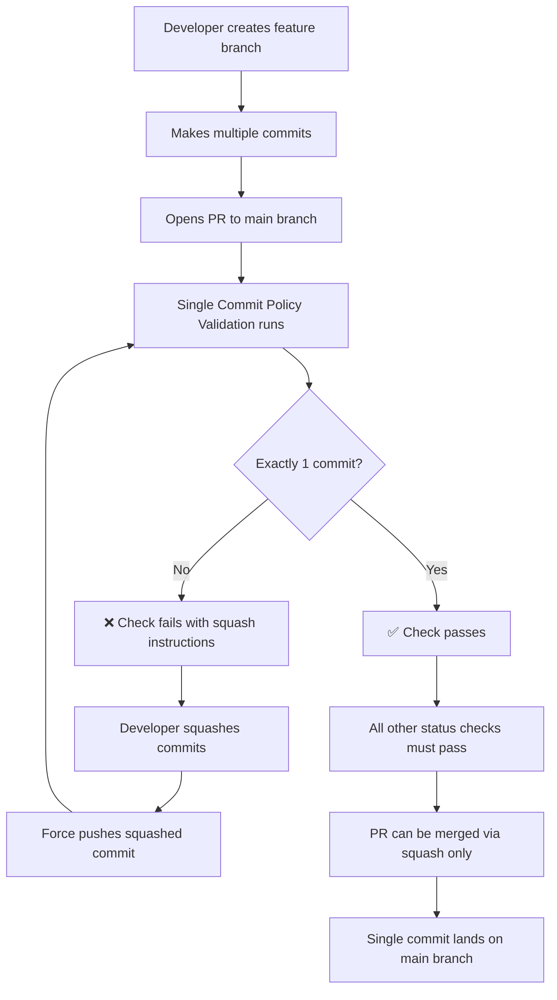

# GitHub Branch Protection Configuration

This document outlines the required GitHub branch protection settings to enforce Yama's single commit per branch policy.

## Required Settings for Main Branch

### Repository Settings → Branches → Add Rule

**Branch name pattern:** `main`

### Protection Rules Configuration

#### 1. Pull Request Requirements

- ✅ **Require a pull request before merging**
- ✅ **Require approvals**: 1
- ✅ **Dismiss stale pull request approvals when new commits are pushed**
- ✅ **Require review from code owners** (if CODEOWNERS file exists)

#### 2. Status Checks

- ✅ **Require status checks to pass before merging**
- ✅ **Require branches to be up to date before merging**

**Required status checks to add:**

- `🔒 Single Commit Policy Validation`
- `🛡️ Code Quality & Security Gate`
- `🤖 GitHub Copilot PR Review`
- `build-check`
- `test (18)`
- `test (20)`

#### 3. Commit Requirements

- ✅ **Require signed commits** (optional, based on security requirements)
- ✅ **Require linear history**

#### 4. Merge Settings

- ✅ **Allow squash merging**
- ❌ **Allow merge commits** (DISABLED)
- ❌ **Allow rebase merging** (DISABLED)

#### 5. Enforcement

- ✅ **Do not allow bypassing the above settings**
- ✅ **Restrict pushes that create merge commits**

### Repository General Settings

Navigate to **Settings → General → Pull Requests**:

- ✅ **Allow squash merging**
  - **Default to pull request title and description**
- ❌ **Allow merge commits** (DISABLED)
- ❌ **Allow rebase merging** (DISABLED)
- ✅ **Always suggest updating pull request branches**
- ✅ **Automatically delete head branches**

## CLI Configuration (Alternative)

You can also configure branch protection via GitHub CLI:

```bash
# Enable branch protection with single commit enforcement
gh api repos/:owner/:repo/branches/main/protection \
  --method PUT \
  --field required_status_checks='{"strict":true,"contexts":["🔒 Single Commit Policy Validation","🛡️ Code Quality & Security Gate","🤖 GitHub Copilot PR Review","build-check"]}' \
  --field enforce_admins=true \
  --field required_pull_request_reviews='{"required_approving_review_count":1,"dismiss_stale_reviews":true}' \
  --field restrictions=null \
  --field required_linear_history=true \
  --field allow_force_pushes=false \
  --field allow_deletions=false

# Configure repository merge settings
gh api repos/:owner/:repo \
  --method PATCH \
  --field allow_squash_merge=true \
  --field allow_merge_commit=false \
  --field allow_rebase_merge=false \
  --field delete_branch_on_merge=true
```

## Verification

After configuration, verify the settings by:

1. **Creating a test branch** with multiple commits
2. **Opening a pull request** to the main branch
3. **Confirming the Single Commit Policy Validation check runs** and fails
4. **Squashing commits** and confirming the check passes
5. **Attempting to merge** and confirming only squash merge is available

## Enforcement Flow



## Benefits

- **Clean commit history** on main branch
- **Enforced semantic commit messages**
- **Prevented merge commits** that clutter history
- **Automated validation** with clear error messages
- **Developer guidance** for fixing violations
- **Consistent workflow** across all contributors

## Troubleshooting

### Common Issues

**Issue**: "Required status check is not passing"
**Solution**: Ensure the workflow file is on the default branch and the check name matches exactly

**Issue**: "Cannot push to protected branch"  
**Solution**: All changes must go through pull requests - no direct pushes allowed

**Issue**: "Multiple commits detected"
**Solution**: Follow the squashing instructions provided by the validation check

**Issue**: "Linear history required"
**Solution**: Use rebase instead of merge to update your branch, then squash commits

## Advanced Configuration

### Custom Branch Rules

For development or staging branches, you may want different rules:

```yaml
# .github/settings.yml
branches:
  - name: develop
    protection:
      required_status_checks:
        strict: false
        contexts:
          - "test"
          - "build-check"
      enforce_admins: false
      required_pull_request_reviews:
        required_approving_review_count: 1
        dismiss_stale_reviews: false
      restrictions: null
      allow_force_pushes: true
      allow_deletions: false
```

### Team-based Restrictions

For larger teams, you can restrict who can merge:

```yaml
branches:
  - name: main
    protection:
      restrictions:
        users: ["lead-developer"]
        teams: ["yama-maintainers"]
```

### Required Status Checks Setup

Ensure these workflows exist and generate the required status checks:

1. **CI Workflow** (`ci.yml`)
   - Must include `test` and `build-check` jobs
   - Should run on pull requests to main

2. **Single Commit Enforcement** (`single-commit-enforcement.yml`)
   - Must generate `🔒 Single Commit Policy Validation` status
   - Should run on pull requests to main

3. **Quality Gate** (`ci.yml` - quality-gate job)
   - Must generate `🛡️ Code Quality & Security Gate` status
   - Should include comprehensive validation

4. **AI Review** (`copilot-review.yml`)
   - Must generate `🤖 GitHub Copilot PR Review` status
   - Should provide automated code analysis

## Security Considerations

- **Never bypass protection rules** in production
- **Review external contributor PRs carefully** (they may not trigger all checks)
- **Regularly audit branch protection settings**
- **Monitor for unauthorized changes** to protection rules
- **Use signed commits** for critical repositories

---

_This configuration ensures Yama maintains enterprise-grade security and quality standards while enforcing clean git history._
